

# Automatyczna Inspekcja Optyczna (AOI) płytek PCB
### Porównanie YOLO11 oraz YOLO26 w wykrywaniu defektów produkcyjnych

**Autor:** Oskar Dulik

---

## 1. Wprowadzenie

### Opis problemu i motywacja
* **Problem:** Manualna kontrola jakości pakietów PCB w przemyśle elektronicznym jest podatna na błędy ludzkie, kosztowna i powolna.
* **Dlaczego to ważne?** Przeoczenie mikroskopijnej wady (np. zwarcia lub przerwania ścieżki) prowadzi do awarii całego urządzenia.
* **Cel projektu:** Stworzenie systemu automatycznej inspekcji optycznej (AOI) opartego na głębokim uczeniu, zdolnego do natychmiastowej lokalizacji i klasyfikacji mikro-defektów w czasie rzeczywistym. Porównanie modeli YOLO dwóch róznych generacji.

---

## 2. Dane (Dataset)

### Źródło i charakterystyka zbioru danych
* **Repozytorium:** Dataset **DeepPCB** (liniowe skany matrycowe płytek drukowanych). - https://universe.roboflow.com/tack-hwa-wong-zak5u/deeppcb-4dhir/dataset/1
* **Format obrazu:** Monochromatyczne o stałym wymiarze **$640 \times 640$ pikseli**.
* Obrazy zostały pozyskane z wycinków oryginalnych zdjęć o rodzielczości 16000x16000 pikseli
* **Struktura podziału danych (Data Splits):**
  * **Train (Treningowy):** 1050 obrazów (70%)
  * **Validation (Walidacyjny):** 150 obrazów (10%)
  * **Test (Testowy):** 300 obrazów (20%), wybrałem duży rozmiar zbioru testowego w celu bardzo dokładnego porównania osiągów modeli .

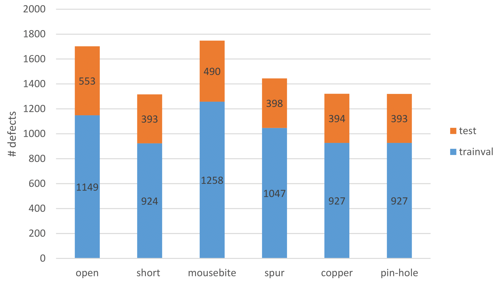

---

  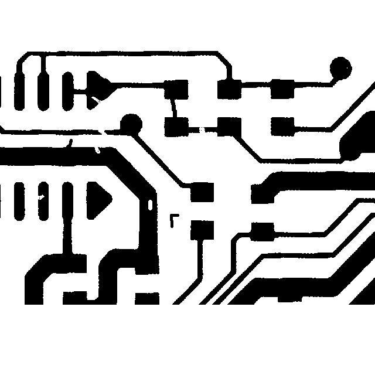
  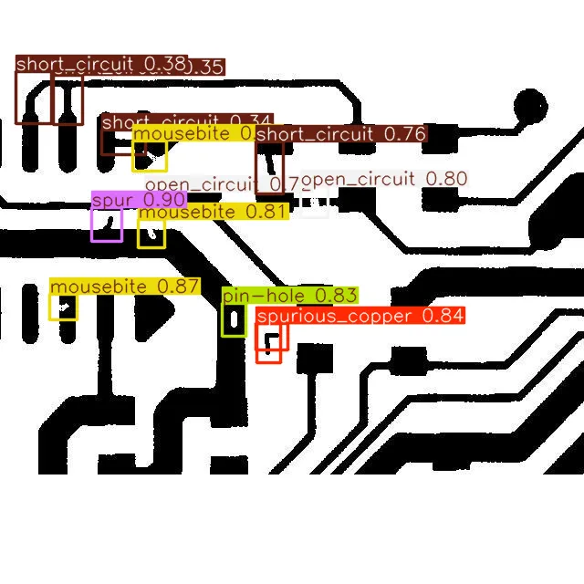

  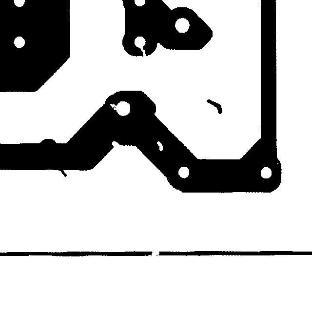
  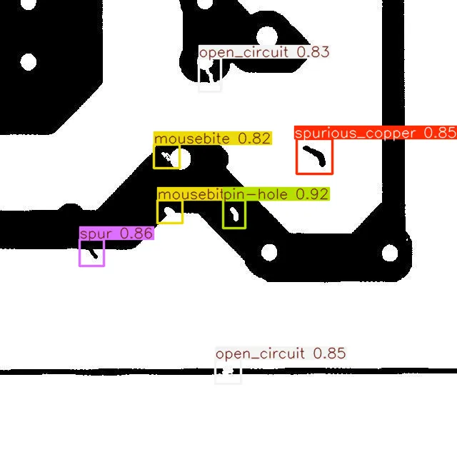

---

## 2.1 Dane – Eksploracja i Rozkład Klas

* **Łączna liczba próbek:** 1500 obrazów
* **Klasy występujące w datasecie:**
  1. `open_circuit` (przerwa w obwodzie)
      

      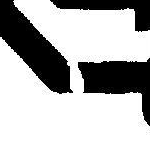
      

  2. `short_circuit` (zwarcie)
      

      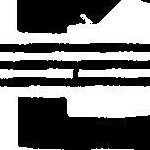
      

  3. `mousebite` (przewężenie lub ubytek krawędzi ścieżki miedzianej. Krawędź wygląda tak, jakby została "nadgryziona")
      

      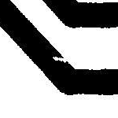
      

  4. `spur` (Ostry, nieregularny występ miedzi odchodzący od krawędzi ścieżki w kierunku sąsiedniego obszaru izolowanego.)
       

      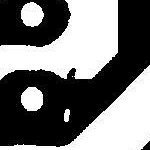
      

  5. `spurious_copper` (miedź szczątkowa)
       

      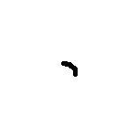
      

  6. `pin_hole` (nakłucie/otwór)
       

      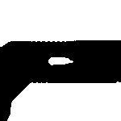
      

  
*Adnotacje zostały znormalizowane do natywnego formatu YOLO: `<class_id> <x_center> <y_center> <width> <height>`.*

---

## 2. Dane – Preprocessing i Augmentacja

Projekt zrealizowano w oparciu o rygorystyczny eksperyment podzielony na dwa podejścia:

### Podejście A: Brak augmentacji (Baseline)
* Trening na surowych, niezmienionych obrazach w celu oceny natywnej zdolności architektury do ekstrakcji cech z ograniczonej próby.

### Podejście B: Augmentacja defaultowe dobrane przez ultralytics

| Parametr | Aktywna Wartość | Opis Działania w Domenie PCB / AOI                                                                                                                                      |
| :--- | :---: |:------------------------------------------------------------------------------------------------------------------------------------------------------------------------|
| **`mosaic`** | `1.0` | **Mozaika (100% szans):** Łączy 4 losowe zdjęcia w jeden kafelkowy obraz.                                                                                               |
| **`fliplr`** | `0.5` | **Horyzontalne odbicie lustrzane (50% szans):** Losowo obraca płytkę w osi lewo-prawo.                                                                                  |
| **`translate`** | `0.1` | **Losowe przesunięcie (10%):** Przesuwa obraz w pionie i poziomie o maksymalnie 10% wymiaru.                                                                            |
| **`scale`** | `0.5` | **Skalowanie geometryczne (50%):** Losowo pomniejsza lub powiększa obraz w zakresie od $0.5\times$ do $1.5\times$.                                                      |
| **`erasing`** | `0.4` | **Random Erasing (40% szans):** Losowo zamalowuje prostokątny fragment obrazu szarym tłem.                                                                              |
| **`auto_augment`** | `randaugment` | **RandAugment:** Losowe przekształcenia według wewnętrznego algorytmu ultralytics                                                                                       |
| **`hsv_s`** | `0.7` | **Nasycenie HSV (70%):** Losowa modyfikacja nasycenia kolorów o maksymalnie 70%.                                                                                        |
| **`hsv_v`** | `0.4` | **Jasność HSV (40%):** Losowa zmiana jasności obrazu o maksymalnie 40%. |
| **`hsv_h`** | `0.015` | **Odcień HSV (1.5%):** losowa korekta  barwnej.                                                                                                       |

### Podejście C: Augmentacje dobrane pod PCB

| Parametr | Wartość | Uzasadnienie inżynierskie (Specyfika procesu AOI / PCB) |
| :--- | :---: | :--- |
| **`mosaic`** | `1.0` | **Mozaika (100% szans):** Łączy 4 losowe kadry w jeden kafelkowy obraz. Drastycznie zwiększa zagęszczenie obiektów w pojedynczym kroku (batchu), wymuszając na sieci intensywną naukę detekcji mikroskopijnych defektów (np. `pin-hole`, `spur`). |
| **`degrees`** | `90.0` | **Obroty ortogonalne ($90^\circ$):** Pozwala na losowe obracanie obrazu o kąty proste. Odzwierciedla to rzeczywiste sytuacje, w których płyta PCB trafia na podajnik maszyny inspekcyjnej obrócona o $90^\circ$, $180^\circ$ lub $270^\circ$, zapobiegając utracie orientacji przez model. |
| **`fliplr`** | `0.5` | **Odbicie horyzontalne (50% szans):** Odwraca obraz w osi lewo-prawo. Pomaga modelowi uniezależnić się od kierunku prowadzenia ścieżek miedzianych na projekcie topologicznym. |
| **`flipud`** | `0.5` | **Odbicie wertykalne (50% szans):** Odwraca obraz w osi góra-dół. Generuje lustrzane odbicia geometryczne układu, podwajając unikalność próbek o zachowanym realizmie fizycznym. |
| **`erasing`** | `0.2` | **Random Erasing (20% szans):** Losowo usuwa i zamalowuje niewielki prostokątny fragment struktury. Uodparnia sieć na lokalne anomalie niespowodowane wadami produkcyjnymi (np. drobinki kurzu lub pyłki na obiektywie kamery). |
| **`translate`** | `0.05` | **Translacja przestrzenna (5%):** Delikatnie przesuwa kadr w pionie i poziomie. Symuluje to mikroskopijne błędy mechanicznego pozycjonowania stołu roboczego XY lub chwytaka pneumatycznego w linii montażowej. |
| **`hsv_v`** | `0.1` | **Fluktuacja jasności (10%):** Wprowadza minimalne, losowe zmiany w intensywności oświetlenia. Odwzorowuje to rzeczywiste wahania natężenia światła w fabryce lub naturalne starzenie się diod LED w komorze cieniowej maszyny AOI. |

## 3. Modele i Metody

### **Ultralytics YOLO11 Nano (Mechanizm Atencji)**
* Wykorzystuje gęste bloki `C3k2` oraz moduł atencji przestrzennej **C2PSA**. Zmusza sieć do ignorowania pustego podłoża laminatu i skupienia na ścieżkach miedzianych.
* **Głowica:** Klasyczna (One-to-Many) z użyciem *Distribution Focal Loss (DFL)*. Wymaga algorytmu NMS (Non-Maximum Suppression).

  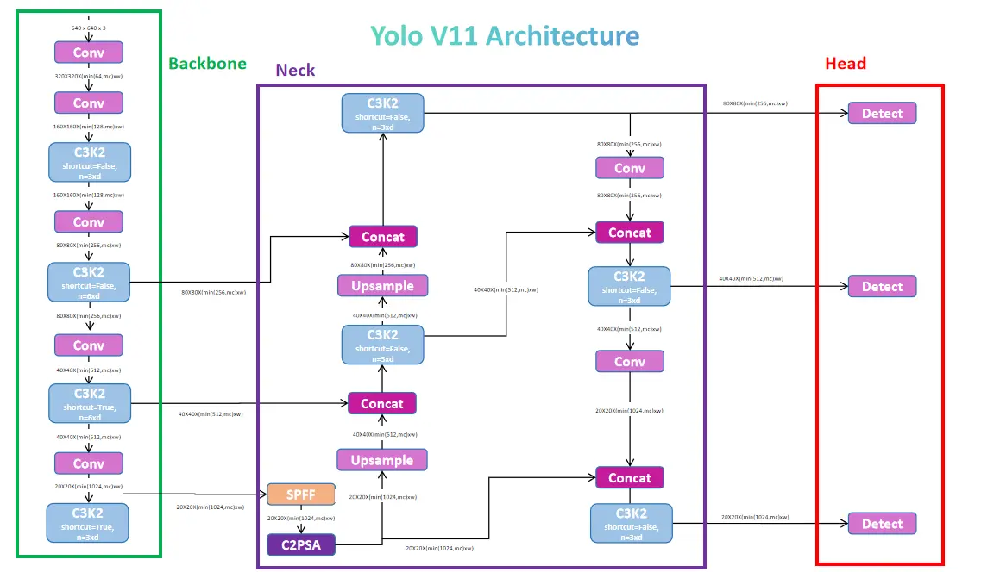

### **Ultralytics YOLO26 Nano (Native End-to-End)**
* Architektura zoptymalizowana pod kątem redukcji opóźnień (Edge Deployment).
* **Głowica:** Nowatorska konstrukcja **One-to-One**. Sieć zwraca dokładnie jeden ramkowy box na defekt, **całkowicie eliminując potrzebę użycia zasobożernego NMS** na procesorze.

  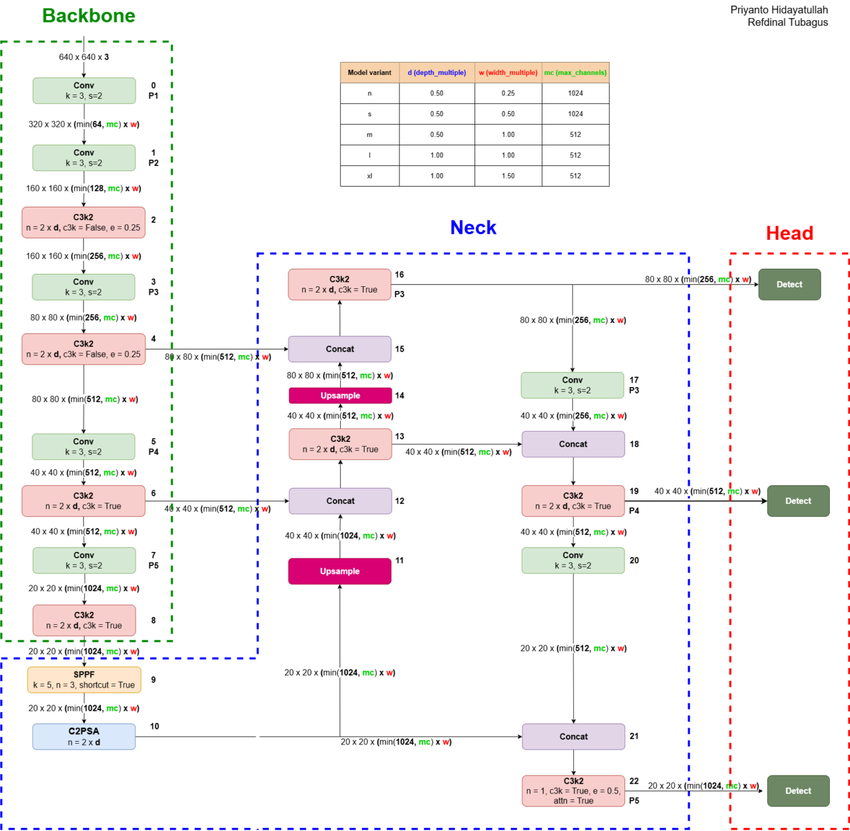

### Blok SPPF (Spatial Pyramid Pooling - Fast)
* **Do czego służy:** Agregacja cech o różnej wielkości i budowanie globalnego kontekstu obrazu.
* **Jak działa:** Przepuszcza dane sekwencyjnie przez serię warstw *Max Pooling* z oknem $5 \times 5$, a następnie łączy wyniki.
* **Znaczenie w projekcie:** Pozwala modelowi wykrywać te same obiekty niezależnie od tego, czy są duże (z bliska), czy bardzo małe (w tle).

---

### Blok C2PSA (Cross-Stage Partial Spatial Attention)
* **Do czego służy:** Zaawansowany moduł uwagi przestrzennej (Spatial Attention).
* **Jak działa:** Przypisuje matematyczne wagi do mapy cech, zmuszając sieć do skupienia "wzroku" na kluczowych detalach i ignorowania pustego tła.
* **Znaczenie w projekcie:** Kluczowy dla wykrywania małych obiektów oraz defektów, które są częściowo zasłonięte lub niewyraźne.

---

### Blok C3K2 (Cross Stage Partial with kernel size 2)
* **Do czego służy:** Głęboka ekstrakcja cech (krawędzi, kształtów) oraz przyspieszenie przepływu informacji w sieci.
* **Jak działa:** Dzieli mapę cech na dwie ścieżki (jedna idzie przez lekkie konwolucje, druga skrótem), a na koniec łączy je z powrotem.
* **Znaczenie w projekcie:** Pozwala modelom YOLO11 i YOLO26 uczyć się dokładniej, jednocześnie drastycznie zmniejszając liczbę parametrów i wagę pliku `.pt`.

---

## 3. Modele – Hiperparametry Treningu

Aby zachować pełną porównywalność, oba modele uruchomiono z identycznymi hiperparametrami:

* **Rozmiar obrazu wejściowego (`imgsz`):** 640
* **Maksymalna liczba epok (`epochs`):** 100
* **Rozmiar paczki (`batch`):** 32 
* **Precyzja obliczeniowa (`amp`):** True (Automatyczna mieszana precyzja FP16 dla rdzeni Tensor)
* **Early stopping (`patience`):** 15 epok 
* **Learning rate (`lr`):** 0.001
* **Automatycznie dobrany optymalizator przez silnik, dla obu modeli był to AdamW (`optimizer=auto`)**

---

## 4. Przebieg Treningu i Napotkane Problemy

### Wyzwanie 1: Początkowe błędy formatowania danych (`labels.cache`)
* *Problem:* Oryginalny format DeepPCB podawał współrzędne w surowych pikselach z klasą na końcu linii. Powodowało to odrzucanie zdjęć przez parser jako uszkodzonych.
* *Rozwiązanie:* Ściągnięcie danych o etykietach w formacie zgodnym z YOLO.

### Wyzwanie 2: Błąd braku pamięci GPU (`CUDA out of memory`)
* *Problem:* Przez użycie notebooków pamięć ram i vram nie były odpowiednio czyszczone.
* *Rozwiązanie:* Przerzucenie kodu do zwykłych plikow pythona.

---

## 5. Wyniki

*Zbiorcze zestawienie metryk uzyskanych na zbiorze walidacyjnym (Validation Set).*

| Konfiguracja Eksperymentu               | mAP@0.5   | mAP@0.5:0.95   | Precision   | Recall   |   F1-Score |
|:----------------------------------------|:----------|:---------------|:------------|:---------|-----------:|
| **YOLO11n (Bez Augmentacji)**           | 94.41%    | 75.74%         | 92.14%      | 89.50%   |       0.91 |
| **YOLO11n (Z standardową Augmentacją)** | 95.96%    | 71.95%         | 93.53%      | 89.80%   |       0.92 |
| **YOLO26n (Bez Augmentacji)**           | 92.77%    | 75.27%         | 89.47%      | 89.14%   |       0.89 |
| **YOLO26n (Z standardową Augmentacją)** | 95.24%    | 71.79%         | 90.93%      | 89.58%   |       0.9  |
| **YOLO26n (Z customową Augmentacją)**   | 95.80%    | 72.38%         | 92.22%      | 91.03%   |       0.92 |
| **YOLO11n (Z customową Augmentacją)**   | 97.51%    | 75.17%         | 94.62%      | 94.62%   |       0.95 |

---

## 5. Wyniki – Wizualizacje i Wyjście Modelu

### YOLO11n (Bez Augmentacji)

### YOLO11n (Z customową Augmentacją)

### YOLO26n (Bez Augmentacji)

### YOLO26n (Z customową Augmentacją)

---

## 5.1 Finalne wyniki

Do ostatecznego testu na odizolowanym zbiorze testowym wybrano konfiguracje, które osiągnęły najlepsze metryki w fazie walidacji.

### **Wyniki na zbiorze Testowym:**

* **CPU**

| Konfiguracja Eksperymentu             | mAP@0.5 | mAP@0.5:0.95   | Precision   | Recall   |   F1-Score | Inference Time (ms)   |
|:--------------------------------------|:--------|:---------------|:------------|:---------|-----------:|:----------------------|
| **YOLO11n (Z customową Augmentacją)** | 97.39%  | 74.84%         | 96.25%      | 93.36%   |       0.95 | 46.88 ms              |
| **YOLO26n (Z customową Augmentacją)** | 96.75%  | 72.28%         | 93.49%      | 91.26%   |       0.92 | 45.08 ms              |

* **GPU** - Wzrost szybkości inferencji YOLO26n względem YOLO11n - **34,42%**

| Konfiguracja Eksperymentu             | mAP@0.5   | mAP@0.5:0.95   | Precision   | Recall   |   F1-Score | Inference Time (ms)   |
|:--------------------------------------|:----------|:---------------|:------------|:---------|-----------:|:----------------------|
| **YOLO11n (Z customową Augmentacją)** | 97.38%    | 74.83%         | 96.28%      | 93.31%   |       0.95 | 2.76 ms               |
| **YOLO26n (Z customową Augmentacją)** | 96.76%    | 72.27%         | 93.49%      | 91.27%   |       0.92 | 1.81 ms               |

### Macierze pomyłek dla 1) YOLO26, 2) YOLO11  

---

## 6. Wnioski i Dyskusja

* **YOLO11** okazało się lepszym modelem do testowanego rozwiązania wbrew początkowej hipotezie, możliwe że przyczynił się do tego dfl loss, który został usunięty w modelu YOLO26
* **YOLO26** udowadnia swoją przewagę w testach prędkości. Usunięcie wąskiego gardła w postaci post-processingu NMS spowodowało przyspieszenie inferencji o 34% na GPU.
* Oba modele uzyskały zadowalające osiągi z f1score na poziomie powyżej 90%, architektura YOLO doskonale nadaje się do analizy obwodów drukowanych. 

### Ograniczenia projektu:
* Dataset DeepPCB operuje w idealnych, laboratoryjnych warunkach o stałym oświetleniu. Realna fabryka wprowadza refleksy światła i drgania taśmy.
* Przez ograniczenia sprzętowe w środowisku treningowym użyte zostały najmniejsze wersje obu modeli z dopiskiem nano, ich najbardziej zaawansowane wersje mają nawet 17 razy więcej parametrów.
* Testy prędkość inferencji zostały przeprowadzone na domowym PC przez co nie odpowiadają w pełni środowisku docelowemu jakim byłby najprawdopodobniej system wbudowany.

---

## 6.1 Wnioski – Co dalej?

### Co zrobiłbym inaczej / Następne kroki:
1. **Wdrożenie na systemy wbudowane:** Konwersja wag z formatu PyTorch do zoptymalizowanych formatów wykonawczych **ONNX** lub **TensorRT** w celu dokłądniejszego zbadania czasu inferencji na mikrokomputerach przemysłowych.
2. **Rozszerzenie Augmentacji o Szum Kamer:** Dodanie losowego szumu Gaussowskiego i symulacji rozmycia ruchu, by uodpornić model na niedoskonałości optyki obiektywów.
3. **Test innych wersji modeli:** Warto przetestować większe wersje tych samych modeli, te użyte w projekcie to najmniejsze jakie były dostępne.
4. **Test modeli na innym datasecie:** Użyty dataset składał się ze zdjęć o doskonałym kontraście i wysokiej rozdzielczości, niektóre linie produkcyjne mogą mieć gorszej jakości kamery, warto przetestować modele na trudniejszych danych. 
---
